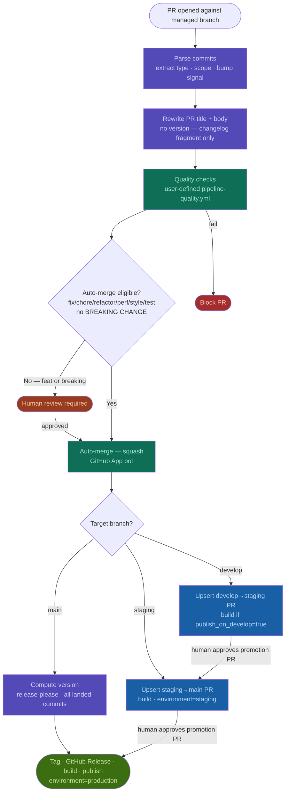

# Autonomous release pipeline — design specification

## Overview

A language-agnostic, branch-topology-agnostic CI/CD orchestration layer hosted as reusable GitHub Actions workflows. Adopters supply their own build and publish workflows; this pipeline supplies everything else: conventional commit parsing, semver versioning, changelog generation, PR lifecycle management, promotion gating, and release tagging.

Designed for a high-velocity, AI-agent-dominant development model where human review gates are triggered by **change type**, not by branch position.

---

## Core design decisions

### Human review is gated on change type, not branch

| Commit type | Auto-merge | Notes |
|---|---|---|
| `fix`, `chore`, `refactor`, `perf`, `style`, `test` | ✅ Yes | After quality checks pass |
| `feat` | ❌ No | Always requires human review |
| Any type with `BREAKING CHANGE` footer or `!` suffix | ❌ No | Always requires human review, overrides auto-merge config |
| `feat!`, `refactor!`, etc. | ❌ No | Breaking change flag takes precedence |

This list is configurable in `.pipeline.yml` (see config reference). The breaking change override is not configurable — it always requires human review.

### Semver across branches

Pre-release versions follow [semver 2.0.0](https://semver.org/) strictly:

```
develop  →  1.2.0-dev.1, 1.2.0-dev.2, ...
staging  →  1.2.0-rc.1, 1.2.0-rc.2, ...
main     →  1.2.0
```

The identifiers map directly to branch purpose: `dev` = development snapshot from `develop`, `rc` = release candidate from `staging`. Both are valid semver pre-release identifiers and sort correctly below the release version (`dev` < `rc` < release by lexicographic comparison). The counter resets when the base version changes.

A git tag is applied to every commit that represents a published artifact:
- `v1.2.0-dev.3` on develop
- `v1.2.0-rc.1` on staging
- `v1.2.0` on main

### Version/changelog engine: release-please (as a library, not orchestrator)

`release-please` handles conventional commit parsing and changelog generation. The pipeline calls it as a step to compute the next version and produce a changelog fragment. It does **not** drive branch strategy or PR creation — the orchestrator owns those.

### Auth: GitHub App

All bot actions (PR creation, PR body updates, tag pushes, comment posting, triggering downstream workflows) use a GitHub App token. This is required because:

- `GITHUB_TOKEN` cannot trigger new workflow runs from push events (prevents downstream workflows from firing)
- PATs are per-user and create operational coupling to individuals
- A GitHub App provides fine-grained per-repo permissions and a proper bot identity

Adopters install the GitHub App and store `APP_ID` and `APP_PRIVATE_KEY` as repo secrets. The pipeline exchanges these for a short-lived installation token at the start of each run.

### Merge strategy

Default: **squash merge**. Configurable per-repo in `.pipeline.yml`. Squash produces one conventional commit per PR on the target branch, which is exactly what `release-please` expects for clean version computation.

### Merge queue

When multiple PRs are open against the same branch simultaneously — the expected state in an agent swarm — a merge queue serializes them without requiring manual rebasing. GitHub's native merge queue is the recommended mechanism. When enabled on a branch, the pipeline bot enqueues eligible PRs rather than merging them directly. GitHub creates a temporary branch combining the PR with everything ahead of it in the queue, re-runs required status checks against that combined state, and only completes the merge if checks pass. See the [merge queue section](#merge-queue-1) for full configuration guidance.

---

## Branch topology

### Fixed promotion order

The pipeline always promotes in the order `develop → staging → main`. This is a deliberate, non-configurable constraint — not an arbitrary one. Each branch has fixed semantics regardless of which ones are enabled:

- `develop` — integration point for feature branches; produces `dev` pre-release builds
- `staging` — release candidate validation; produces `rc` pre-release builds
- `main` — production; produces release versions

Disabling a branch collapses the adjacent steps but does not change what the remaining branches mean. If `staging` is disabled, `develop` still means integration and `main` still means production — the promotion PR just goes directly between them.

### Branch flags

Branches are enabled independently via `.pipeline.yml`. The pipeline reads these flags at runtime on every invocation, so changes take effect on the next PR without modifying any workflow files or rulesets.

```yaml
pipeline:
  branches:
    develop: true
    staging: false
    main: false
```

The promotion chain is derived automatically from whichever branches are enabled, always in `develop → staging → main` order through the active set.

### Supported combinations

| develop | staging | main | Promotion chain | Pre-release versions |
|---|---|---|---|---|
| ✅ | ✅ | ✅ | develop → staging → main | `dev`, `rc`, release |
| ✅ | ❌ | ✅ | develop → main | `dev`, release |
| ❌ | ✅ | ✅ | staging → main | `rc`, release |
| ✅ | ✅ | ❌ | develop → staging | `dev`, `rc` (no prod release) |
| ✅ | ❌ | ❌ | develop only | `dev` builds only |
| ❌ | ❌ | ✅ | main only | release only |
| ❌ | ✅ | ❌ | staging only | `rc` builds only |

The default is `develop: true, staging: false, main: false` — optimised for the common early-development case where a developer is publishing preview builds before owning a production environment or app store presence. Enabling additional branches later is purely additive and requires no changes to workflow files, rulesets, or any other configuration.

### Starting at either end

A repo can start from either end of the chain and add branches in any direction:

**Develop-first (default):** Start with `develop: true` only. Feature branches PR against `develop`, `dev` pre-release builds are published on every merge. When ready for production, enable `main: true` — the promotion PR from `develop` to `main` begins appearing automatically. Optionally insert `staging: true` at any point to add a validation gate between them.

**Main-first:** Start with `main: true` only. Feature branches PR directly against `main`, every merge produces a release. Add `develop: true` later to introduce an integration branch without changing any existing configuration — `main` retains its role and the promotion chain lengthens behind it.

In both cases, enabling a new branch requires only two things: creating the branch in git (`git checkout -b staging && git push -u origin staging`) and flipping the flag in `.pipeline.yml`. The entrypoint workflows already listen on all three branch names; a branch that does not exist simply never triggers them.

### Effect on rulesets

Rulesets are defined per branch name and are inert for branches that do not exist. When a new branch is created and enabled, the existing ruleset immediately applies to it — no ruleset changes are needed at enablement time. Adopters should create all three branch rulesets during initial setup even if only one branch is active, so the protection is in place the moment each branch is introduced.

### Hotfix / frictionless patch path

In all configurations, `fix` commits auto-merge through every active branch without human gates as long as quality checks pass. There is no special hotfix branch or flow — the commit type alone determines the path. An AI agent (or human) opens a PR with a `fix:` commit against the lowest active branch; if checks pass, it propagates through the promotion chain to `main` and is released with no human intervention.

---

## Pipeline architecture

### Wiring model: reusable workflows + thin entrypoints

The pipeline lives in `your-org/release-pipeline` as reusable workflow files. Adopting repos contain:

1. **Thin entrypoint workflows** (3 files, ~10 lines each) that fire on GitHub events and call the orchestrator
2. **`.pipeline.yml`** — repo-level config
3. **`pipeline-build.yml`** and **`pipeline-publish.yml`** — user-defined workflows at known paths, accepting the standard input contract

```
adopting-repo/
├── .github/
│   └── workflows/
│       ├── on-pr.yml              ← calls orchestrator on pull_request events
│       ├── on-push.yml            ← calls orchestrator on push to managed branches
│       ├── pipeline-build.yml     ← user-defined, accepts standard inputs
│       └── pipeline-publish.yml   ← user-defined, accepts standard inputs
└── .pipeline.yml                  ← repo config
```

The orchestrator calls back into the adopting repo's build/publish workflows via `workflow_call` at the paths declared in `.pipeline.yml` (defaulting to the names above).

### Workflow files in `your-org/release-pipeline`

```
release-pipeline/
└── .github/
    └── workflows/
        ├── orchestrator.yml       ← main reusable workflow (workflow_call)
        ├── pr-lifecycle.yml       ← PR body/title management + quality checks
        ├── promote.yml            ← branch promotion + promotion PR management
        └── release.yml            ← tag creation + GitHub Release + publish dispatch
```

---

## Workflow call contract

### Inputs the orchestrator receives (from adopting repo entrypoints)

```yaml
inputs:
  event_type:
    description: 'pr_opened | pr_updated | pr_merged | push'
    required: true
  source_branch:
    required: true
  target_branch:
    required: true
```

### Inputs the build workflow receives (from orchestrator)

```yaml
inputs:
  version:
    description: 'Full semver string, e.g. 1.2.0-alpha.3 or 1.2.0'
    required: true
  changelog:
    description: 'Markdown changelog fragment for this version'
    required: true
  environment:
    description: 'develop | staging | production'
    required: true
  artifact_path:
    description: 'Where to write the build artifact for the publish step'
    required: true
    default: 'dist/'
```

### Inputs the publish workflow receives (from orchestrator)

```yaml
inputs:
  version:
    required: true
  changelog:
    required: true
  environment:
    required: true
  artifact_path:
    description: 'Path to artifact produced by the build step'
    required: true
```

The publish workflow decides what to do with `environment` — it may publish to different registries, app stores, or artifact stores per environment. The orchestrator does not need to know about those destinations.

---

## Pipeline flow diagram



---

## Event flows

### Flow 1: Auto-mergeable commit (fix/chore/refactor/perf/style/test, no breaking change)

```
developer opens PR (fix: ...) against develop/main
  └── on-pr.yml fires → orchestrator
        ├── parse commits → extract type, scope, description, bump signal
        ├── rewrite PR title + body with changelog fragment (no version)
        ├── run quality checks (calls user-defined quality workflow)
        └── if checks pass → enqueue PR (merge queue) or auto-merge PR (squash)
              │   [orchestrator detects merge queue via GitHub API and routes accordingly]
              └── on-push.yml fires → orchestrator
                    ├── if develop (full/dual mode):
                    │     ├── compute version from landed commits (dev pre-release)
                    │     ├── trigger build (environment=develop) if publish_on_develop=true
                    │     └── upsert promotion PR (develop→staging or develop→main)
                    │           └── recompute PR title+body with accumulated changelog + version
                    ├── if staging (full mode):
                    │     ├── compute version from landed commits (rc pre-release)
                    │     ├── trigger build (environment=staging)
                    │     └── upsert promotion PR (staging→main) with version
                    └── if main:
                          ├── compute version from all landed commits (release-please)
                          ├── generate final changelog
                          ├── apply git tag (e.g. v1.2.3)
                          ├── create GitHub Release
                          ├── trigger build (environment=production)
                          └── on build complete → trigger publish (environment=production)
```

### Flow 2: Feature or breaking change commit

Same as Flow 1 through the quality check step. After checks pass:

```
quality checks pass → post "ready for review" status on PR
  └── human reviews PR
        ├── requests changes → developer commits → Flow 1/2 restarts from top
        └── approves → merges PR
              └── continues from "on-push.yml fires" in Flow 1
```

### Flow 3: Promotion PR (develop→staging, staging→main)

Promotion PRs are created automatically when changes land on a source branch. They are owned by the pipeline bot — title and body are recomputed on every push to the source branch to accumulate the full changelog of pending changes.

```
push to develop
  └── orchestrator upserts promotion PR (develop→staging)
        ├── if PR doesn't exist: create it, set title + body
        └── if PR exists: recompute title + body with accumulated changelog

human reviews promotion PR
  ├── fix/chore commits in the PR → these auto-merged individually already,
  │   but the promotion PR itself still requires human approval
  │   (promotion PRs are always human-reviewed — they represent an environment gate)
  └── approves → merges
        └── triggers staging build + upserts staging→main promotion PR
```

> **Note:** Individual feature/fix PRs are auto-merged based on commit type. Promotion PRs (branch-to-branch) are always human-reviewed because they represent an intentional environment promotion decision. This is the correct level for human oversight.

---

## PR title and body format

The pipeline bot owns PR title and body for all PRs it manages. Human reviewers should treat the body as pipeline output — if they want to add context, they use PR comments, not the body.

### Feature/fix PR title

```
<type>(<scope>): <description>
```

Example: `feat(auth): add OAuth2 PKCE flow`

No version suffix. The version is not known at PR-open time — it depends on what else lands before this PR, which is not deterministic. Displaying a predicted version here would be wrong for any PR except the first to merge.

### Feature/fix PR body

```markdown
## Changes

<!-- Generated from conventional commits -->
### feat
- add OAuth2 PKCE flow (abc1234)

### fix
- handle token refresh race condition (def5678)

---
**Version bump:** minor
**Target:** develop
**Quality checks:** ✅ passed
```

The body shows the *bump signal* (major / minor / patch) rather than a specific version number. This tells reviewers the significance of the change without making a false precision claim. The actual version is computed just-in-time when the merge commit lands on the target branch.

### Promotion PR title

```
chore(release): promote develop → staging [v1.3.0-rc.1]
```

### Promotion PR body

Accumulated changelog of all commits pending in this promotion, formatted as a standard CHANGELOG.md fragment.

---

## `.pipeline.yml` reference

```yaml
pipeline:
  # Which branches are active in the promotion chain.
  # The pipeline always promotes develop → staging → main through whichever are enabled.
  # Changing these flags takes effect immediately with no workflow or ruleset changes.
  # Default is develop-only — optimised for preview/pre-production development.
  branches:
    develop: true
    staging: false
    main: false

  # Merge strategy for auto-merged PRs: squash | merge | rebase
  merge_strategy: squash

  # Which commit types auto-merge without human review
  # BREAKING CHANGE always requires human review regardless of this list
  auto_merge_types:
    - fix
    - chore
    - refactor
    - perf
    - style
    - test

  # Publish a develop-environment artifact on every auto-merge to develop
  publish_on_develop: true

  # Publish a staging-environment artifact on every merge to staging
  publish_on_staging: true

  # Merge queue: set to true if GitHub merge queue is enabled on managed branches.
  # When true, the bot calls the enqueue API instead of the merge API for eligible PRs.
  # The orchestrator also auto-detects this via the GitHub API, so this flag is optional
  # and only needed to force-disable auto-detection.
  merge_queue: auto  # auto | true | false

  # Paths to user-defined workflows (relative to .github/workflows/)
  # Override to avoid filename collisions with existing workflows
  workflows:
    build: pipeline-build.yml
    publish: pipeline-publish.yml
    quality: pipeline-quality.yml   # optional; if absent, quality checks are skipped

# Initial version if no tags exist
initial_version: 0.1.0
```

---

## Version computation rules

Version is computed **just-in-time on push to a managed branch**, never at PR-open time. This ensures the version always reflects the actual set of commits that have landed, regardless of the order PRs were opened or reviewed.

1. Find the latest semver tag on the target branch lineage — the highest `v*` tag reachable from `main`. If none, use `initial_version` from config.
2. Parse all conventional commits since that tag on the current branch (i.e. commits that have landed, not commits in open PRs).
3. Determine bump:
   - Any `BREAKING CHANGE` or `!` → MAJOR
   - Any `feat` → MINOR
   - Any `fix`, `perf`, etc. → PATCH
   - `chore`, `style`, `test`, `refactor` → no version bump (no release generated)
4. Compute pre-release identifier (applies only when triggered by push, not at PR-open time):
   - On `develop`: append `-dev.N` where N increments from the last `-dev` tag for this base version
   - On `staging`: append `-rc.N` where N increments from the last `-rc` tag for this base version
   - On `main`: release version, no suffix
5. Tag format: `v{MAJOR}.{MINOR}.{PATCH}[-{pre-release}]`

### Why JIT versioning is correct with a merge queue

With a merge queue, PRs land in a serialized but potentially reordered sequence relative to when they were opened. A `feat` PR opened after a `fix` PR may land first if the `fix` fails queue checks and gets ejected. JIT versioning handles this correctly: whichever PR lands first gets the version computed from the commits present at that moment. The next PR to land gets a fresh computation against the updated tag. No prediction, no collision, no stale version claims in PR titles.

### Edge case: chore-only changes

If all commits since the last tag are `chore`/`style`/`test`/`refactor` (no version bump), no release is generated. A build artifact may still be published (controlled by `publish_on_develop` / `publish_on_staging`) but no new version tag is created.

---

## Adopter onboarding checklist

1. **Install the GitHub App** and store `APP_ID` + `APP_PRIVATE_KEY` as repo secrets
2. **Copy entrypoint workflows** (`on-pr.yml`, `on-push.yml`) into `.github/workflows/`
3. **Create `.pipeline.yml`** — minimal config is just the `branches` flags; default is `develop: true` only
4. **Create `pipeline-build.yml`** accepting the standard build inputs
5. **Create `pipeline-publish.yml`** accepting the standard publish inputs
6. *(Optional)* Create `pipeline-quality.yml` for custom quality checks; if absent, the quality gate is skipped
7. **Configure rulesets and branch protection** per the guidance in the section below
8. **Tag an initial version** if you have existing code: `git tag v0.1.0 && git push --tags`

---

## Branch protection and rulesets

This section describes the GitHub branch protection rules and rulesets required to make the pipeline work correctly in an AI agent swarm environment. The goal is to make it structurally impossible for agents (or humans) to bypass pipeline conventions — not just policy-impossible.

### Why rulesets over classic branch protection rules

Classic branch protection rules still work, but GitHub Rulesets are preferred here because:

- Rulesets support **bypass actors** with fine-grained scoping — you can grant the GitHub App bot bypass permission without granting it to all admins or all users with a given role.
- Rulesets can be applied to **tag patterns** in addition to branches, which is needed to protect the version tag namespace.
- Rulesets are **exportable as JSON** and can be checked into the repo or managed via the GitHub API, making them reproducible across environments.
- Multiple rulesets can stack on the same branch; you can layer a "base protection" ruleset with a "merge method enforcement" ruleset independently.

Classic branch protection rules should only be used as a fallback if rulesets are unavailable on your GitHub plan tier.

---

### Ruleset 1: Protect managed branches from direct pushes

**Target pattern:** `main`, `staging`, `develop` (create all three rulesets upfront; they are inert for branches that do not yet exist)

**Enforcement:** Active

**Bypass actors:** GitHub App bot (the pipeline bot only — no humans, no other apps)

**Rules to enable:**

| Rule | Setting | Rationale |
|---|---|---|
| Restrict updates | Enabled | Only the bot bypass actor can push directly; everyone else must use PRs |
| Restrict deletions | Enabled | Prevents agents from deleting managed branches |
| Require a pull request before merging | Enabled | All changes must arrive via PR, including bot auto-merges |
| Require status checks to pass | Enabled — add `pipeline / quality` check | Blocks merge (including bot auto-merge) if quality checks fail |
| Block force pushes | Enabled | Prevents history rewriting on managed branches |
| Require linear history | Enabled | Enforces squash/rebase merge only; prevents merge commits polluting conventional commit history |

**Key constraint for agents:** An AI agent cannot push a branch called `main` or push directly to `main` — it must open a PR. The bot is the only actor permitted to merge without the normal PR approval flow (which it uses for auto-merges of eligible commit types).

---

### Ruleset 2: Enforce conventional commit format on PR titles

**Target pattern:** `main`, `staging`, `develop`

**Enforcement:** Active

**Bypass actors:** GitHub App bot

**Rules to enable:**

| Rule | Setting | Rationale |
|---|---|---|
| Require a pull request before merging → **Require conversation resolution before merging** | Enabled | Prevents merging PRs that have unresolved review comments from quality check bots |
| Require a pull request before merging → **Dismiss stale reviews when new commits are pushed** | Enabled | An agent adding a commit to a PR that was already approved must re-trigger review; prevents stale approval being used to bypass re-check |

> **Note:** GitHub does not natively enforce conventional commit format via rulesets. The pipeline enforces this at the workflow level — the `pr-lifecycle` workflow validates that all commits on the PR branch match the conventional commit pattern and fails the required status check if they do not. The ruleset's role is to make that status check non-bypassable.

---

### Ruleset 3: Protect the version tag namespace

**Target pattern:** `v*` (matches all version tags)

**Enforcement:** Active

**Bypass actors:** GitHub App bot only

**Rules to enable:**

| Rule | Setting | Rationale |
|---|---|---|
| Restrict creations | Enabled | Only the pipeline bot can create `v*` tags; agents cannot manually mint version tags |
| Restrict updates | Enabled | Version tags are immutable once created (per semver spec) |
| Restrict deletions | Enabled | Prevents tag deletion which would break version history and re-trigger release logic |

This is the most important ruleset for version integrity. Without it, an agent could push `v1.2.3` to an arbitrary commit, causing the version computation logic to produce incorrect next versions.

---

### Ruleset 4: Restrict feature branch naming (optional but recommended)

**Target pattern:** All branches not matching `main`, `staging`, `develop`

**Enforcement:** Active

**Bypass actors:** None (applies to all actors including the bot)

**Rules to enable:**

| Rule | Setting | Rationale |
|---|---|---|
| Restrict creations — **branch name pattern** | Must match `(feat\|fix\|chore\|refactor\|perf\|style\|test\|docs)/.*` | Ensures branch names reflect their conventional commit type; makes it obvious what an agent is working on |

This is optional but valuable in a swarm environment — it makes the intent of every branch machine-readable from the branch name alone, and prevents agents from creating untyped branches like `agent-work-123` that obscure what they contain.

---

### Repository-level settings (not ruleset-based)

These are set in **Settings → General** and apply repo-wide regardless of rulesets:

| Setting | Value | Rationale |
|---|---|---|
| Allow merge commits | Disabled | Only squash and rebase allowed; prevents agents choosing merge commit method |
| Allow squash merging | Enabled | Pipeline default merge strategy |
| Allow rebase merging | Enabled | Available as an alternative via `pipeline.yml` config |
| Default squash commit message | **Pull request title and description** | Ensures the PR title (which the bot sets to a conventional commit format) becomes the squash commit message on the target branch |
| Automatically delete head branches | Enabled | Cleans up feature branches after merge; prevents agent branch accumulation |
| Allow auto-merge | Enabled | Required for the bot to trigger GitHub's native auto-merge after setting it on eligible PRs |

---

### GitHub App permissions required

The GitHub App used as the pipeline bot must be granted the following repository permissions:

| Permission | Level | Reason |
|---|---|---|
| Contents | Read and write | Push tags, read commits |
| Pull requests | Read and write | Create, update, and merge PRs |
| Checks | Read and write | Post status checks and quality results |
| Actions | Read | Trigger and monitor workflow runs |
| Metadata | Read | Required by GitHub for all apps |

The App should **not** be granted Admin permission. It should be a bypass actor in specific rulesets, not a blanket admin. This limits the blast radius if the App's private key is ever compromised.

---

### Summary: what agents can and cannot do

| Action | Agent (human or AI) | Pipeline bot |
|---|---|---|
| Push directly to `main`/`staging`/`develop` | ❌ Blocked by ruleset 1 | ✅ Bypass actor |
| Open a PR against any managed branch | ✅ Allowed | ✅ Allowed |
| Merge a PR without passing status checks | ❌ Blocked by ruleset 1 | ❌ Also blocked (status check is required for all) |
| Create a `v*` tag | ❌ Blocked by ruleset 3 | ✅ Bypass actor |
| Delete a `v*` tag | ❌ Blocked by ruleset 3 | ❌ Also blocked (tags are immutable) |
| Force-push to managed branches | ❌ Blocked by ruleset 1 | ❌ Also blocked |
| Create a branch with a non-conventional name | ❌ Blocked by ruleset 4 (if enabled) | ✅ Bypass actor |
| Delete a managed branch | ❌ Blocked by ruleset 1 | ❌ Also blocked |
| Merge a PR that has unresolved bot comments | ❌ Blocked by ruleset 2 | ✅ Bypass actor (bot resolves its own comments before auto-merging) |

---

## Merge queue

### The problem: concurrent PRs in a swarm

In a high-velocity agent environment, it is normal to have 5–20 PRs open against `develop` simultaneously. Without a merge queue:

- PR #1 merges; PRs #2–5 are now behind by one commit
- If branch protection requires up-to-date branches, all four must rebase before they can merge
- Each rebase triggers a new CI run; with N PRs in flight you get O(N²) CI runs in the worst case
- Agents rebasing against each other can create a feedback loop of re-runs

### How GitHub's native merge queue solves this

When merge queue is enabled on a branch, merging a PR does not happen at the moment of approval. Instead:

1. The bot (or human) adds the PR to the queue via the GitHub API
2. GitHub creates a temporary `gh-readonly-queue/{branch}/pr-{N}` branch that combines the PR with all PRs ahead of it in the queue
3. Required status checks run against this combined state
4. If checks pass, the PR merges in queue order; if they fail, only that PR is ejected and the queue continues

No manual rebasing. No stale merges. PRs behind in the queue are automatically tested against the state that will exist when it is their turn to merge.

### Interaction with the pipeline bot

Without merge queue, the orchestrator calls the GitHub merge API directly for auto-eligible PRs. With merge queue, it calls the enqueue API instead. The orchestrator detects which mode is active by checking the branch's ruleset configuration via the GitHub API at runtime — no manual config flag required, though `merge_queue: true/false` in `.pipeline.yml` can override detection.

For human-reviewed PRs (feat/breaking), the bot does not auto-enqueue — it leaves that to the human reviewer, who approves and then clicks "Merge when ready" (which enqueues) in the GitHub UI. The bot's job in that case is purely to run checks and post status.

### Recommended merge queue configuration per branch

**`develop`** — highest throughput needed, most concurrent agent PRs

| Setting | Value | Rationale |
|---|---|---|
| Merge method | Squash | Consistent with pipeline merge strategy |
| Build concurrency | Up to 5 PRs per group | Batching trades some isolation for throughput; suitable for `fix`/`chore` heavy branches |
| Minimum group size | 1 | Don't wait to batch; merge as soon as a PR is ready |
| Maximum group size | 5 | Cap batch size to keep CI time reasonable |
| Status checks | Same as branch protection | Queue re-runs checks against combined state |
| Only merge non-failing PRs | Enabled | Eject a failing PR without blocking the rest of the queue |

**`staging`** — lower volume, higher confidence needed

| Setting | Value | Rationale |
|---|---|---|
| Build concurrency | 1 PR per group | Staging should merge serially; each RC should be individually validated |
| Minimum group size | 1 | |
| Maximum group size | 1 | No batching on staging |

**`main`** — production, serialize strictly

| Setting | Value | Rationale |
|---|---|---|
| Build concurrency | 1 PR per group | One release at a time |
| Require deployments to succeed | Enabled (staging environment) | Only merge to main if staging deployment passed |

### Ruleset update: enable merge queue on managed branches

Add the following to **Ruleset 1** (protect managed branches):

| Rule | Setting |
|---|---|
| Require merge queue | Enabled on `develop`, `staging`, `main` |

This makes it structurally impossible to merge directly without going through the queue, even with bypass permissions for most actors. The pipeline bot is the only bypass actor and should use the queue API, not bypass it.

### Effect on versioning

Merge queue does not change version computation. Each PR that exits the queue produces one squash commit on the target branch, and the push event fires normally, triggering the orchestrator's promotion and versioning logic. The queue's temporary branches (`gh-readonly-queue/...`) are ignored by the `on: push` trigger because they do not match the managed branch patterns.

---

## Example entrypoint workflow files

These two files are **identical across all adopting repos** — copy them as-is. The only thing that varies per-repo is `.pipeline.yml` and the user-defined build/publish/quality workflows. Replace `your-org/release-pipeline` with your actual orchestrator repo reference.

### `.github/workflows/on-pr.yml`

```yaml
# Entrypoint: pull request events on managed branches.
# This file is identical across all adopting repos. Copy it as-is.
# All pipeline logic lives in the orchestrator — nothing here changes
# per-project. Per-project config belongs in .pipeline.yml.

name: Pipeline — PR

on:
  pull_request:
    branches:
      - main
      - staging
      - develop
    types:
      - opened
      - synchronize  # new commit pushed to PR branch
      - reopened
      - ready_for_review

# Cancel any in-progress run for the same PR when a new commit arrives.
# This prevents stale quality checks from blocking an updated PR.
concurrency:
  group: pipeline-pr-${{ github.event.pull_request.number }}
  cancel-in-progress: true

jobs:
  orchestrate:
    # Skip draft PRs — agents should mark PRs ready when they want pipeline
    # feedback. Avoids wasting CI minutes on work-in-progress.
    if: github.event.pull_request.draft == false
    uses: your-org/release-pipeline/.github/workflows/orchestrator.yml@v1
    with:
      event_type: >-
        ${{
          github.event.action == 'opened'      && 'pr_opened'  ||
          github.event.action == 'reopened'    && 'pr_opened'  ||
          github.event.action == 'synchronize' && 'pr_updated' ||
          'pr_opened'
        }}
      source_branch: ${{ github.head_ref }}
      target_branch: ${{ github.base_ref }}
      pr_number: ${{ github.event.pull_request.number }}
    secrets: inherit
```

### `.github/workflows/on-push.yml`

```yaml
# Entrypoint: push events to managed branches.
# Fires after a PR is merged (the merge commit lands on the branch).
# This file is identical across all adopting repos. Copy it as-is.
#
# Note: this will NOT fire when the GitHub App bot pushes using
# GITHUB_TOKEN — the bot uses its App installation token, which
# does trigger this workflow, enabling the promotion and release
# chain to continue automatically.

name: Pipeline — Push

on:
  push:
    branches:
      - main
      - staging
      - develop

# One release/promotion run per branch at a time. A second push
# (e.g. two PRs merging in quick succession) queues rather than
# cancels — we don't want to drop a release trigger.
concurrency:
  group: pipeline-push-${{ github.ref_name }}
  cancel-in-progress: false

jobs:
  orchestrate:
    uses: your-org/release-pipeline/.github/workflows/orchestrator.yml@v1
    with:
      event_type: push
      source_branch: ${{ github.ref_name }}
      target_branch: ${{ github.ref_name }}
    secrets: inherit
```

### Why two files instead of one

A single workflow file can only have one `on:` block. While both triggers could technically be combined, keeping them separate means:

- The `cancel-in-progress` behavior can differ: PR runs should cancel on new commits (stale checks are useless); push/release runs should queue (dropping a release trigger causes silent failures).
- GitHub's workflow run UI labels them separately, making it easier to debug which trigger fired and why.
- The files remain small enough that their purpose is self-evident.

### Adapting the branch trigger list

The entrypoint workflows list all three branch names in their `branches:` filter. This is intentional — a branch that does not exist simply never triggers the workflow, so there is no cost to listing all three upfront. If you are certain a branch will never exist in a given repo, you can remove it from the list to make the intent explicit, but it is not required.

---

## Quality workflow contract

The quality workflow is invoked by `pr-lifecycle` via `workflow_dispatch` and receives:

```yaml
inputs:
  pr_number:
    required: true
    type: string
  sha:
    required: true
    type: string
```

The workflow is expected to (1) check out the repo at `inputs.sha`, (2) run whatever lint/test/static-analysis the adopter wants, and (3) post check results against `inputs.sha` (e.g., via `actions/checkout` + a check-runs API call, or simply by exiting non-zero). The orchestrator polls for completion and treats the workflow's `conclusion` as the merge gate.

`version` and `environment` are intentionally **not** passed — at PR-open time the version is not yet computed (it depends on what else lands first; see "Version computation rules"), and `environment` doesn't apply to PR validation. Quality is about whether THIS PR's commits meet the bar, independent of where they will eventually be deployed.

See `templates/pipeline-quality.yml.example` for a starter.

## Open questions / deferred decisions

- **Notification hooks:** Should the pipeline post Slack/email notifications on release? Out of scope for v1, can be added as a post-publish step in user-defined `pipeline-publish.yml`.
- **Monorepo support:** Multiple releasable packages in one repo. Not in scope for v1 — `release-please` supports this via manifest mode and could be integrated later.
- **Release branch backport:** In `full` mode, if a `fix` merges to `main` directly (e.g. emergency), should it be automatically back-ported to `staging` and `develop`? Currently not handled — the assumption is that all changes flow bottom-up.
